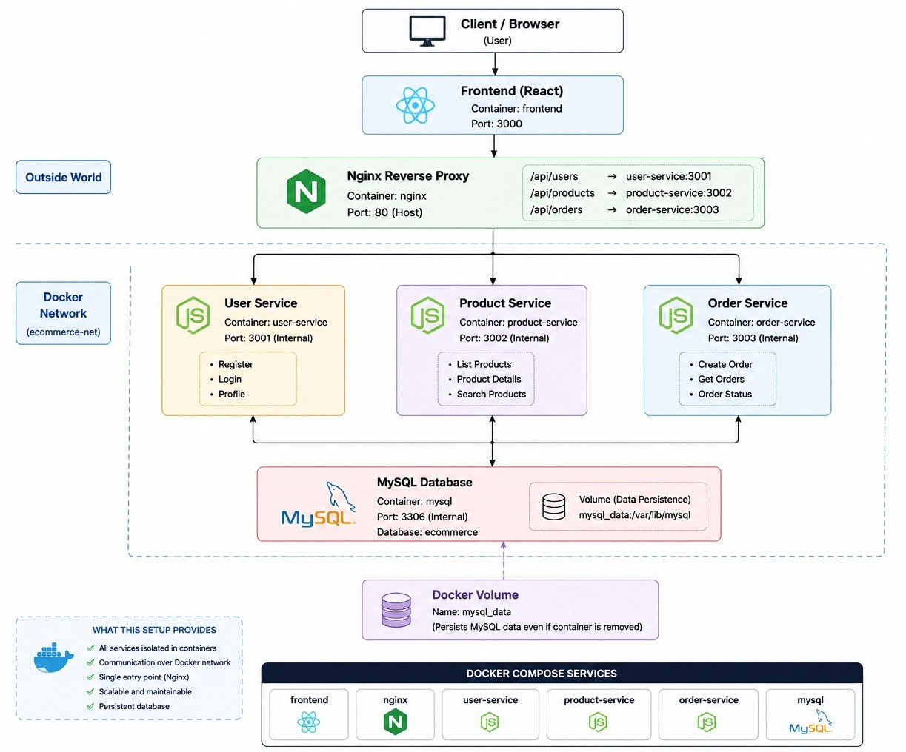

# ShopFlow — React + Node.js + MySQL Microservices

> A full-stack e-commerce platform built with a clean **3-tier microservice architecture**, containerized with Docker and orchestrated via Docker Compose.

---

## 🏗️ Architecture



---

## 📁 Project Structure

```
3tier-app/
├── docker-compose.yml       # Orchestrates all containers
├── architecture.jpeg        # System architecture diagram
│
├── frontend/                # React + Vite SPA (Nginx served)
│   ├── Dockerfile
│   ├── nginx.conf           # Reverse proxy to backend services
│   └── src/
│       ├── pages/           # Dashboard, Products, Orders, Profile
│       ├── components/      # Sidebar, shared UI
│       ├── context/         # AuthContext (JWT state)
│       └── services/        # api.js — all HTTP calls
│
└── services/
    ├── auth-service/        # JWT auth  → auth_db
    ├── user-service/        # Profiles  → user_db
    ├── product-service/     # Products  → product_db
    └── order-service/       # Cart/Orders → order_db
```

> Each service has its own `Dockerfile`, `.env.example`, and `src/` with `routes/`, `controllers/`, `middleware/`, and `db/init.sql`.

---

## 🐳 Container Networking & Port Mapping

All containers are connected via **Docker bridge networks** defined in `docker-compose.yml`.

### Networks

| Network | Purpose |
|---|---|
| `backend-network` | All backend services + Nginx + MySQL talk here |
| `frontend-network` | Isolated layer; Nginx bridges both networks |

> **Key insight:** The `frontend-service` (Nginx) is on **both** networks — it's the only container that touches the outside world on port `8080` and internally routes requests to backend containers by their **service name** (Docker's built-in DNS).

---

### Port Mapping

| Container | Service Name | Host Port → Container Port | Role |
|---|---|---|---|
| `shopflow-frontend` | `frontend-service` | `8080 → 80` | Nginx serves React + proxies API |
| `auth_container` | `auth-service` | `3001 → 3000` | JWT Auth (register, login) |
| `order_container` | `order-service` | `3002 → 3000` | Cart & Orders |
| `product_container` | `product-service` | `3003 → 3000` | Products & Categories |
| `user_container` | `user-service` | `3004 → 3000` | User Profiles & Addresses |
| `mysql-microservices` | `mysql-db` | `3308 → 3306` | Shared MySQL (4 databases) |

> All Node.js services **internally listen on port `3000`** inside their container. The host ports (`3001–3004`) are different just to avoid conflicts on your machine.

---

### How Nginx Routes API Calls (No Separate Gateway Needed)

Nginx inside `shopflow-frontend` acts as the **API Gateway**:

```
Browser → localhost:8080
              │
              ├── /api/auth/*     → http://auth-service:3000
              ├── /api/users/*    → http://user-service:3000
              ├── /api/products/* → http://product-service:3000
              ├── /api/orders/*   → http://order-service:3000
              └── /*              → React SPA (index.html)
```

Container-to-container calls use **Docker DNS** — e.g., `auth-service` resolves to the `auth_container`'s IP automatically. No IPs hardcoded.

---

### MySQL — Single Container, 4 Databases

Rather than running 4 separate MySQL containers, a **single `mysql-db` container** hosts all 4 databases:

| Database | Owned By |
|---|---|
| `auth_db` | auth-service |
| `order_db` | order-service |
| `product_db` | product-service |
| `user_db` | user-service |

Each service's `init.sql` is auto-executed at container startup via `docker-entrypoint-initdb.d/`.

---

## 🚀 Quick Start (Docker)

```bash
# Clone the repo
git clone https://github.com/your-username/3tier-app.git
cd 3tier-app

# Start everything
docker compose up --build -d

# Open the app
http://localhost:8080
```

**Demo Login:** `admin@shopflow.com` / `Admin@123`

---

## 🔌 API Reference

### Auth Service — `localhost:3001`
| Method | Endpoint | Description |
|--------|----------|-------------|
| POST | `/api/auth/register` | Register user |
| POST | `/api/auth/login` | Login |
| POST | `/api/auth/logout` | Logout |
| POST | `/api/auth/refresh` | Refresh token |
| GET | `/api/auth/me` | Get current user |

### User Service — `localhost:3004`
| Method | Endpoint | Description |
|--------|----------|-------------|
| GET | `/api/users` | List all users (admin) |
| GET | `/api/users/:id` | Get profile |
| PUT | `/api/users/:id` | Update profile |
| GET | `/api/users/:id/addresses` | Get addresses |
| POST | `/api/users/:id/addresses` | Add address |
| DELETE | `/api/users/:id/addresses/:addrId` | Delete address |

### Product Service — `localhost:3003`
| Method | Endpoint | Description |
|--------|----------|-------------|
| GET | `/api/products` | List products (search, filter) |
| GET | `/api/products/:id` | Get product |
| POST | `/api/products` | Create product (admin) |
| PUT | `/api/products/:id` | Update product (admin) |
| DELETE | `/api/products/:id` | Soft delete (admin) |
| GET | `/api/products/categories` | List categories |
| PATCH | `/api/products/:id/stock` | Update stock (admin) |

### Order Service — `localhost:3002`
| Method | Endpoint | Description |
|--------|----------|-------------|
| GET | `/api/orders/cart` | Get cart |
| POST | `/api/orders/cart` | Add to cart |
| PUT | `/api/orders/cart/:productId` | Update cart item |
| DELETE | `/api/orders/cart/:productId` | Remove from cart |
| POST | `/api/orders` | Place order |
| GET | `/api/orders` | List orders |
| GET | `/api/orders/:id` | Get order detail |
| PATCH | `/api/orders/:id/status` | Update status (admin) |
| GET | `/api/orders/stats` | Dashboard stats (admin) |

---

## 🛠️ Tech Stack

| Layer | Technology |
|---|---|
| Frontend | React 18, Vite, CSS |
| API Gateway | Nginx (reverse proxy inside Docker) |
| Backend | Node.js, Express.js |
| Auth | JWT (Access + Refresh tokens) |
| Database | MySQL 8 |
| Containerization | Docker, Docker Compose |

---

> **Health check:** Every service exposes `GET /health` — used by Docker's `healthcheck` to ensure MySQL is ready before services start.
